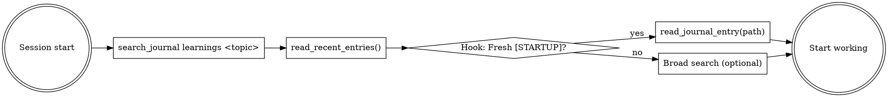
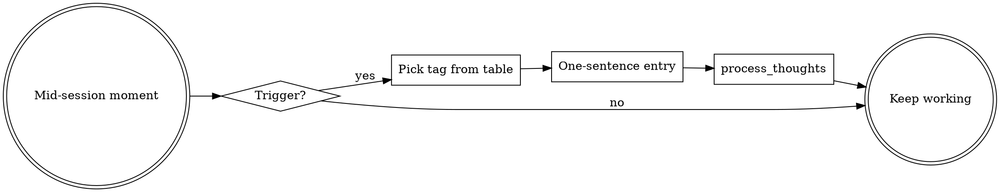

# Journaling

## Overview

The journal in `journals/` is **collective session memory** — committed and shared across every session working in this repo. It only earns its keep when entries are tagged consistently, distilled periodically, and retrieved before being recreated.

**Core principle:** A tagged atomic entry today saves ten reconstructions later.

## The Iron Law

```
SEARCH BEFORE WORK.  TAG WHEN WRITING.  DISTILL BEFORE IT SCATTERS.
```

Untagged entries are unfindable. Scattered entries are unread. Both are equivalent to not writing the entry at all.

## When to Use

- **Every session start** — mandatory search step (hook surfaces some context automatically; this skill is the deeper version)
- **Any time mid-session** — you're surprised, you decide between options, you compare token costs, the user states a preference
- **Every session end** — mandatory `process_thoughts` call
- **Whenever `search_journal` returns 3+ hits on a topic** — time to write a `[STARTUP]` brief

## Decision Flow





## Tag Ontology

Seven tags. Field assignment is **non-negotiable** — wrong field means the entry is unfindable via field-scoped queries.

| Tag | Field | When to use |
|---|---|---|
| `[LEARNING]` | `technical_insights` | Workflow/sequencing improvement future sessions should adopt |
| `[TOKEN-COST]` | `technical_insights` | Compare two paths with measured/estimated tokens |
| `[GOTCHA]` | `project_notes` | Non-obvious tool/codebase behavior that will bite again |
| `[DECISION]` | `reflections` | Path-not-taken: which option chosen, why, what would flip it |
| `[USER-PREF]` | `user_context` | Durable user preference (style, cadence, vetoes) |
| `[STARTUP]` | `project_notes` | Distilled scannable brief for a topic; supersedes scattered notes |
| `[BLOCKER]` | `reflections` | Unresolved obstacle for next session; must include reproducer |

**Collision rule:** if an entry could be two tags, pick the one whose field is correct, then the more specific tag. `[STARTUP]` always wins when it applies.

See `examples.md` for one full entry per tag.

## The `[STARTUP]` Pattern

**Centerpiece for token efficiency.** A single distilled brief replaces N scattered searches at session start.

### Trigger conditions (write or update when ANY holds)

1. 3+ scattered tagged entries exist on a topic (`search_journal("learnings <topic>")` returns 3+ hits).
2. A session ends having reconstructed knowledge already implicit in old entries — retrieval failed.
3. The user explicitly says "remember this for next time" or equivalent.
4. A major plugin/tool change invalidates an existing `[STARTUP]`.

### Template (200–400 words, written into `project_notes`)

```
[STARTUP] <topic-slug>            updated: YYYY-MM-DD  supersedes: <prior date or "—">

TL;DR (1 sentence): <the one thing future-you must know>

Do:
- <action 1>
- <action 2>

Don't:
- <pitfall 1>

Key commands:
- <command>  # <one-line why>

Known gotchas:
- <gotcha> → <workaround>

Open questions:
- <unresolved item or "none">

Source entries: <2-3 dates of underlying scattered entries>
```

### Retrieval priority

1. Session-start hook surfaces fresh `[STARTUP]` entries automatically.
2. If a `[STARTUP]` for your topic exists with `updated:` within 30 days → read it, stop searching that topic.
3. Else fall through to `search_journal("learnings <topic>")` for scattered entries.
4. **Time-box: 90 seconds.** Three searches with no useful hit → start working.

### Supersession (never delete)

A stale `[STARTUP]` is replaced by writing a **new** one with `supersedes: <prior date>`. The old entry remains as audit trail; vector search surfaces the newer one first. Editing or deleting old entries breaks the audit.

## Session Lifecycle

### Session start (90s timebox — run these MCP calls in order)

1. **`search_journal("learnings <task topic>")`** — ALWAYS first. Surfaces workflow improvements accumulated for this exact task so you don't repeat solved problems. Replace `<task topic>` with the actual work at hand (e.g. `learnings lyric writing`, `learnings github PR`, `learnings mastering`).
2. **`read_recent_entries()`** — what happened last time. One call to see the last few full entries.
3. **Hook output check** — the SessionStart hook has already listed recent `[STARTUP]` topics and `[LEARNING]` entries. If a relevant `[STARTUP]` path is named, call `read_journal_entry(<path>)` on it and you're done — that brief was written exactly for this moment.
4. **If no fresh `[STARTUP]`** — optionally follow up with `search_journal("the-agency-system")` for broad context or `search_journal("bitwize-music workflow")` for plugin-specific patterns. Two additional searches max, then start working.

**Stop at 90 seconds.** Three searches returning nothing useful = start working. Digging past the timebox costs more than the occasional re-derivation.

### Mid-session capture

| Trigger | Tag | Field |
|---|---|---|
| "Huh, didn't expect that" | `[GOTCHA]` | `project_notes` |
| "Next time I'd skip step X" | `[LEARNING]` | `technical_insights` |
| "Option A costs ~X, option B costs ~Y" | `[TOKEN-COST]` | `technical_insights` |
| "Going with A because B would…" | `[DECISION]` | `reflections` |
| "User keeps doing/asking X" | `[USER-PREF]` | `user_context` |
| "Stuck — can't proceed because…" | `[BLOCKER]` | `reflections` |

**Capture rule:** one sentence is enough. If you're composing a paragraph, you're overthinking it. Atomic > polished.

### Session end (mandatory `process_thoughts`)

60-second reflection checklist:

1. Was I surprised? → `[GOTCHA]` in `project_notes`
2. What would help future me? → `[LEARNING]` in `technical_insights`
3. Did I waste tokens on a wrong path? → `[TOKEN-COST]` in `technical_insights`
4. Did I make a non-obvious choice? → `[DECISION]` in `reflections`
5. Did I learn the user prefers something? → `[USER-PREF]` in `user_context`
6. Should I write or update a `[STARTUP]`? Yes if 3+ entries now exist on a topic, OR I reconstructed something I shouldn't have had to.

**Minimum fields at close:** `reflections` + at least one of `technical_insights`/`project_notes`. Empty session = `reflections: "no notable events"`. The call itself is still required.

## Tooling

Read-only helpers in `scripts/`:

- **`journal-tags.sh`** — tag frequency audit. Run periodically to catch drift (someone invented `[BUG]`).
- **`journal-distill.sh <topic>`** — aggregates entries matching `<topic>` for review before authoring a `[STARTUP]`. Pure dump; you do the LLM distillation.
- **`journal-stale.sh`** — lists `[STARTUP]` entries by age. Refresh anything `updated:` >30 days when working that topic.

Slash command:

- **`/journal-brief <topic>`** — guided distillation: runs `journal-distill.sh`, reports scattered entries, and prompts to author a `[STARTUP]` if 3+ exist and no fresh one is present.

**Deliberately not built:** wrappers around `process_thoughts` (would add tokens), commit-blocking tag linters (too heavy), search wrappers (`search_journal` is already semantic and fine).

## Common Mistakes

- Writing untagged prose entries — unfindable via tag-scoped searches
- Tagging in the wrong field — unfindable via field-scoped queries
- Composing paragraphs mid-session — overhead becomes a reason to skip capture
- Searching past the 90s timebox at session start — the cost of digging is greater than the cost of relearning
- Editing or deleting old `[STARTUP]` entries instead of superseding them — breaks the audit trail
- Writing a `[STARTUP]` from a single session — distillations aggregate; first drafts are `[LEARNING]` entries

## Red Flags — STOP

| Rationalization | Reality |
|---|---|
| "This is too small to record" | Atomic entries are the most searchable. One sentence beats none. |
| "I'll remember this" | Future-you doesn't have your context window. Future-them isn't you. |
| "I'll batch it at session end" | Batched entries lose specifics; the vivid detail is gone in 20 minutes. |
| "Nothing notable happened this session" | Write that exact sentence in `reflections`. Empty-but-present beats missing. |
| "There's already an entry on this" | If you had to re-derive it, retrieval failed — write a `[STARTUP]`, don't shrug. |
| "A `[STARTUP]` is too much work right now" | `/journal-brief` exists precisely so it isn't. Run it. |
| "The tag doesn't quite fit" | Pick the closest; consistency > precision. Drift is the real enemy. |
| "Running out of context, skip the close-out" | The close-out is the highest-leverage call. Do it first if budget is tight. |
| "This is a one-off, not a pattern" | `[GOTCHA]` is for one-offs. That's the whole point of the tag. |
| "Already wrote about this last week" | Then update it (`supersedes:`), don't duplicate or skip. |

## Example — end-to-end

**Session start.** Hook outputs:

```
### [STARTUP] briefs (last 30 days):
  - github-cli-vs-mcp (updated 2026-05-14) — journals/2026-05-14/...
### Recent [LEARNING] entries (last 3 days):
journals/2026-05-15/09-29-23.md:[LEARNING] ToolSearch before any MCP call...
```

Task is "open a PR review loop." `[STARTUP] github-cli-vs-mcp` is fresh — read it, get the CLI commands, start work.

**Mid-session.** Hit a surprise: `gh pr view --comments` returns Markdown but `gh api .../comments` returns JSON. One sentence:

```
process_thoughts(project_notes: "[GOTCHA] gh pr view --comments returns rendered MD; for structured access use gh api /repos/:o/:r/pulls/:n/comments.")
```

**Session end.** Run the checklist:
- Surprise? Yes → already captured.
- Help future me? `[LEARNING] When reviewing PR comments, gh api beats gh pr view for filtering.`
- Token cost? `[TOKEN-COST] gh api ~150 tok vs mcp pull_request_read get_review_comments ~600.`
- 3+ entries on `github-cli-vs-mcp` now? Yes → update the `[STARTUP]` with `supersedes: 2026-05-14` and a fresh `updated:` date.

One `process_thoughts` call writes all four fields. Next session opens with the refreshed `[STARTUP]` and skips this rediscovery entirely.
