# Agency routing — decision tree

The router walks this graph to convert a user intent into a single
`agency_skill_dispatch` call. Edges are labelled with the trigger; nodes
are skills (or built-in router actions).

```dot
digraph agency_routing {
  rankdir=LR;
  node [shape=box, style=rounded, fontname="monospace"];
  start [label="user message", shape=oval, style=filled, fillcolor="#eef"];

  health     [label="health-check (MCP)"];
  sessload   [label="session-load\nPlan/_session-state/*.md"];
  search     [label="agency_skill_search"];
  describe   [label="agency_skill_describe"];
  dispatch   [label="agency_skill_dispatch"];
  prereqwalk [label="walk prerequisites:\nfrontmatter graph"];
  relatedhop [label="follow related:\n(cross-domain)"];
  cmnudge    [label="emit code-mode nudge"];

  start -> health      [label="session start"];
  health -> sessload   -> search [label="ready"];
  start -> sessload    [label="\"where am I?\""];
  start -> prereqwalk  [label="\"what next?\""];
  start -> search      [label="intent only"];
  start -> relatedhop  [label="cross-domain"];

  search -> describe     [label="≥1 candidate"];
  prereqwalk -> describe [label="next unmet"];
  relatedhop -> describe [label="related: target"];
  describe -> cmnudge    [label="prefers_codemode"];
  cmnudge -> dispatch;
  describe -> dispatch   [label="otherwise"];
  dispatch -> sessload   [label="handoff reminder", style=dashed];

  search    -> sessload [label="0 candidates →\nstale cache?", style=dotted, color="#a00"];
  prereqwalk -> sessload [label="unmet prereq →\nremind", style=dotted, color="#a00"];
}
```

## Notes

- **Session start path** is always `health-check → session-load → search`. Never skip health-check on a fresh session.
- **`prerequisites:` walk** is the canonical "what next?" answer. The router reads the frontmatter graph of the current domain's skills, finds the first skill whose `prerequisites:` are all satisfied (per state cache), and recommends it. The user may decline; the recommendation is optional, not mandatory.
- **`related:` is the only legal cross-domain bridge.** Music → Jules handoff requires an explicit `related: [jules]` edge on the source skill. Same for novel ↔ agentic.
- **Stale cache fallback:** if `agency_skill_search` returns 0 candidates for a known-good intent, suspect a stale state cache — re-run `session-load` (which triggers `rebuild_state`) before re-searching.
- **Code-mode nudge** fires once, before dispatch, when `prefers_codemode: true`. It is advisory — the router does not rewrite calls.
